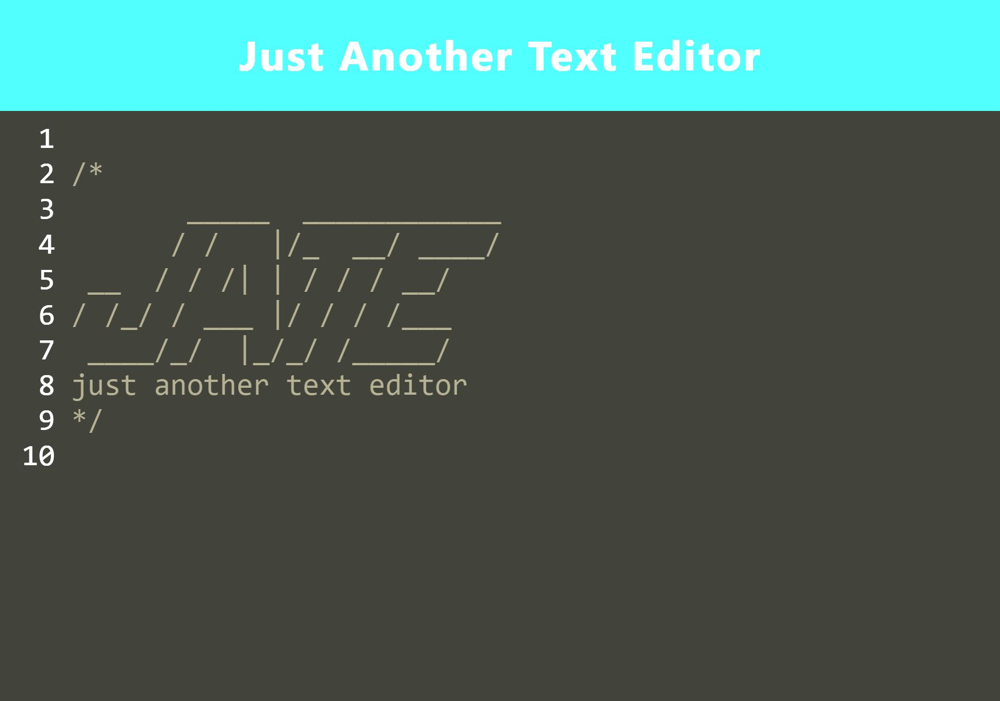

# Text Editor

## Installation

1. Download/ Clone this repository.
2. **Node.js** is required to test this app.
3. `npm install` in terminal to install required dependencies.

## Usage

* `npm start` to start server.
* In browser go to: `localhost:3000`
* or visit the [Deployed App](https://tranquil-wildwood-34262.herokuapp.com/)

## Features

* Javascript
* Insomnia
* .env
* MongoDB
* Mongoose
* npm

Copyright (c) Boiledlettuce. All rights reserved.